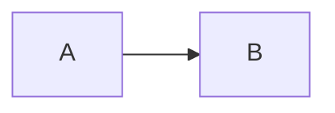

# QuickMark Markdown Cheat Sheet

Each example pairs **Markdown source** with its **Rendered result** below. Use **Copy** on a source block, then paste into the main editor to try it. Copy shows **Copied!** and announces success. This read-only Help window never replaces your document. **Help → Markdown Examples** provides an editable practice window.

This guide is original QuickMark documentation. It describes QuickMark's current CommonMark-derived dialect with tables, strikethrough, automatic links, and typography. It does not claim complete CommonMark or GitHub Flavored Markdown compatibility.

## Paragraphs and line breaks

Separate paragraphs with a blank line. A single newline within a paragraph is a soft break, normally displayed as a space. For a hard line break, end the line with a backslash or two spaces. The backslash is easier to see in this example.

```markdown
This is one paragraph,
continued on another source line.

This is a second paragraph.\
This starts a new rendered line in that paragraph.
```

## Headings

Use one through six `#` characters followed by a space. For an alternative level-one or level-two heading, underline the text with `=` or `-` characters. Keep a blank line before the heading to avoid accidentally underlining preceding text.

```markdown
# Level one
## Level two
### Level three
#### Level four
##### Level five
###### Level six

Alternative level one
=====================

Alternative level two
---------------------
```

## Emphasis and strikethrough

Asterisks or underscores mark emphasis; double delimiters mark strong emphasis. Strikethrough uses two tildes. Underscores within a word do not normally introduce emphasis.

```markdown
*Italic* and _also italic_.
**Bold** and __also bold__.
***Bold and italic***.
~~No longer current~~.
```

## Inline code, escapes, and entities

Backticks display literal code. Use a longer run of backticks when the code itself contains a backtick. Backslash escapes prevent punctuation from acting as Markdown. Named and numeric character entities work outside code; inside code they remain literal source.

```markdown
Use `config.json`.
Write ``a `backtick` inside code``.
\*These asterisks stay visible\* and \# this is not a heading.
An ampersand: &amp; — a less-than sign: &#60;.
```

## Blockquotes

Prefix lines with `>`. Quotes can contain paragraphs, lists, formatting, and nested quotes.

```markdown
> A **quoted** observation.
>
> Another paragraph.
>
> > A nested quote.
```

## Unordered and ordered lists

Use `-`, `+`, or `*` plus a space for bullets. Ordered items use a number followed by `.` or `)`. The first number sets the start; subsequent source numbers need not be sequential. Indent nested material to align with the parent item's text. Blank lines between items create looser spacing.

```markdown
- First item
  - Nested item
- Second item

3. Start at three
4. Continue counting
   1. Nested ordered item

- An item with two paragraphs.

  This paragraph belongs to the same item.
```

## Thematic breaks

A line with three or more matching `-`, `*`, or `_` characters makes a horizontal rule. Put a blank line before it so hyphens do not turn preceding text into a Setext heading.

```markdown
Text before the rule.

---

Text after the rule.
```

## Fenced and indented code blocks

Use at least three backticks or tildes. A language label is optional: QuickMark retains it but does not provide colored syntax highlighting. Code is displayed, never executed. To show a fence inside a fence, use a longer outer fence, as this guide does.

````markdown
```js
const greeting = "Hello";
```

~~~text
A tilde-fenced block.
~~~
````

Indent each line by four spaces for an indented code block, separated from preceding prose by a blank line. Both block styles receive the same Copy control. Copy preserves leading and interior whitespace but removes terminal blank lines.

```markdown
A paragraph before the code.

    first code line
    second code line
```

## Tables

Separate columns with pipes and follow the header with a separator row. Colons choose left, center, or right alignment. Escape a literal pipe with a backslash, including inside a table's inline code. Tables contain inline formatting, not multiline block content. **Insert → Table…** can build the source for you.

```markdown
| Item | State | Count |
| :--- | :---: | ---: |
| **Notes** | Ready | 12 |
| A \| B | `x\|y` | 3 |
```

## Web links and email

HTTP and HTTPS links open in the default browser. Mailto links open the registered mail application. They do not replace the QuickMark window. Link text can contain inline formatting; a quoted title is optional. Angle brackets make an explicit URL or email autolink, and bare URL-like text is linked automatically.

```markdown
[Secure website](https://example.com "Example website")
[HTTP website](http://example.com)
[Email the team](mailto:team@example.com)
<https://example.com>
<team@example.com>
https://example.com
```

## Reference links

Separate the destination from its use. Full, collapsed, and shortcut references work when a matching definition exists; labels match without regard to case. Definitions do not appear as separate rendered paragraphs.

```markdown
Read [the guide][manual].
Visit [Home][].
Return to [Home].

[manual]: https://example.com/guide "Guide"
[Home]: https://example.com
```

## Relative document links

**Save your main document first.** Relative resources use that document's folder, not the application folder. This bundled cheat sheet has no filesystem folder: copy the example into a saved document to try it. Relative links in the result below cannot open files from this Help window. Supply your own files at the illustrated paths.

Relative `.md`, `.markdown`, and `.txt` links open in a new tab or focus an existing tab in the same editor window; the current tab and its unsaved edits remain intact. Missing or inaccessible targets report an error and preserve the current document. Use forward slashes for these relative paths; encode spaces as `%20` or enclose a destination containing spaces in angle brackets.

```markdown
[Sibling notes](./notes.md)
[Parent folder guide](../guide.markdown)
[Plain text](./notes.txt)
[Meeting notes](./Meeting%20notes.md)
[Another spaced path](<./Meeting notes.md>)
```

## Images

Images use `!` before link syntax. Provide useful alternative text: it describes the image when it cannot be loaded. Optional titles use quotes. Reference-style image destinations also work.

Relative local images need a saved document and an existing file. Local PNG, JPEG, GIF, WebP, and BMP files up to 10 MiB are supported. Missing, inaccessible, oversized, or unsupported images show alternative text and an explanatory tooltip or status message.

Explicit HTTP(S) image URLs load remotely and need a reachable image. The example URLs below are illustrative; replace them with your own image URLs. The rendered result attempts to load remote images; these illustrative URLs may show alternative text rather than a picture. Local image results show alternative text here because this bundled guide has no filesystem folder.

```markdown


![Reference-style image][diagram]

[diagram]: ./images/diagram.webp "Diagram"
```

## Typography

Outside code, QuickMark converts straight quotation marks and selected sequences into typographic characters. Use code spans when you need the literal characters to remain visible.

```markdown
"Quoted words" and 'single quotes'.
Copyright (c), registered (r), trademark (tm).
An ellipsis... and dashes -- or ---.
Literal code: `"quotes" (c) ... --`.
```

## Currently unsupported optional syntax

These are current limitations, not permanent exclusions. Copy these examples to see how ordinary Markdown rules handle them; do not expect the extension's usual output.

- **Task lists:** `[ ]` and `[x]` remain text, not interactive checkboxes.
- **Footnotes and definition lists:** no extension plugins are enabled; ordinary paragraph or link-reference rules may interpret similar-looking text.
- **Heading IDs and front matter:** no automatic heading IDs, `{#id}` attributes, or YAML/TOML/JSON metadata processing. Delimiter lines may still act as rules or heading underlines.
- **Math and diagrams:** TeX-style math stays text. Mermaid and other diagram fences remain code.
- **Other plugins:** no added abbreviations, emoji shortcodes, superscript, subscript, inserted/marked text, containers, or generated table of contents.

````markdown
- [ ] An unchecked task
- [x] A checked task

A footnote reference[^note].

[^note]: Footnote-like source.

Term
: Definition-like source

## Heading {#custom-id}

$x^2$ and $$x^2$$



:smile: H~2~O x^2^ ++inserted++ ==marked==
````

## Deliberate safety restrictions

These differ from the optional syntax above:

- **Raw HTML is escaped:** tags appear as text instead of becoming elements. Scripts, embedded frames, and HTML styling are not enabled.
- **Link destinations are restricted:** HTTP, HTTPS, mailto, fragment-only anchors, and supported relative document paths are accepted. Schemes such as `javascript:`, `data:`, and `vbscript:`, absolute filesystem paths, and unsupported relative file types are rejected.
- **Image destinations are restricted:** use HTTP(S) or supported relative local images. Data URLs, SVG, absolute filesystem paths, and other explicitly schemed local targets are not loaded.

A fragment-only link can scroll to an existing matching rendered element, but QuickMark does not generate heading IDs. Consequently, linking to a heading by guessing its slug will not work; this is not a table-of-contents feature.

```markdown
<strong>This appears as literal HTML, not bold text.</strong>
[Requires an existing target](#existing-target)
```
